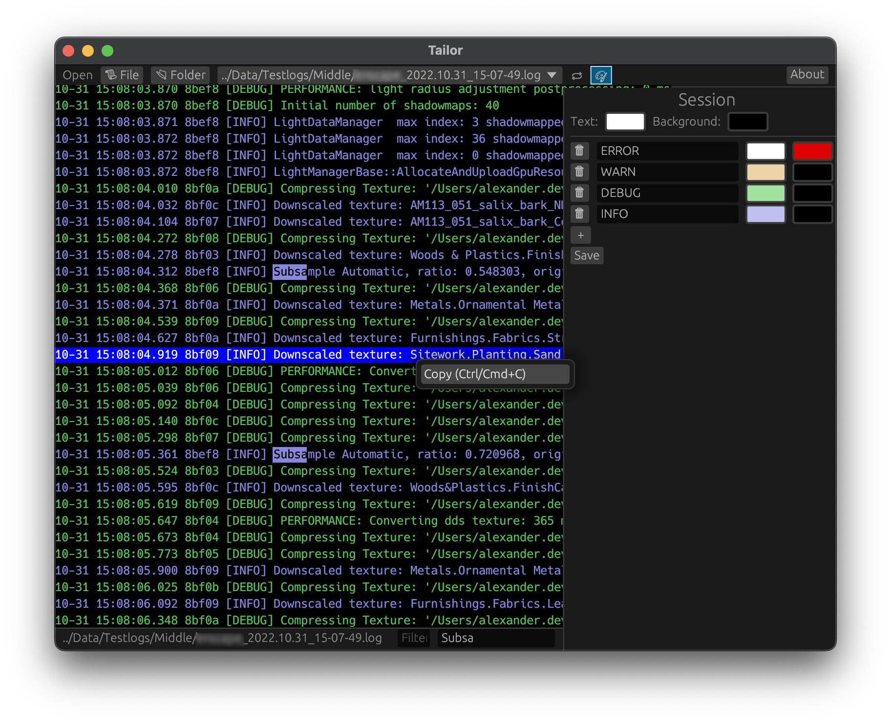

# Tailor

Lightweight and quick log file viewer featuring:

* Automatic log file following, just like unix utility `tail` does
* Automatic switching to the latest updated file in selected directory
* Pattern-based line highlighting
* Session preferences featuring patterns and highlight settings

Features still missing:
* Automatic scroll to follow new lines
* Button to toggle automatic scroll
* Search and filter
* Alert: display alert when encountering specified pattern in log

## Building

This is a Rust project - have Rust toolchain installed and run `carbo build` to build and/or `cargo run` to run Tailor. Please refer to Cargo manual for more options.

## Download

There are no pre-built binaries available for download yet.

## Support

Everyone is welcome to take part in development by submitting bug reports and fixing those, or adding new functionality.
